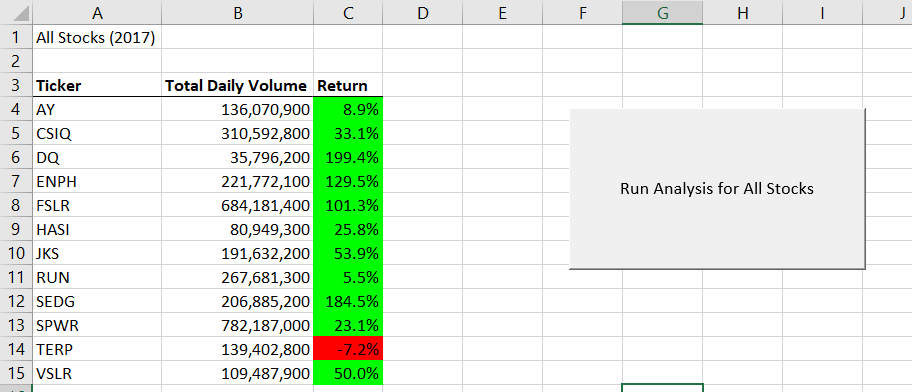
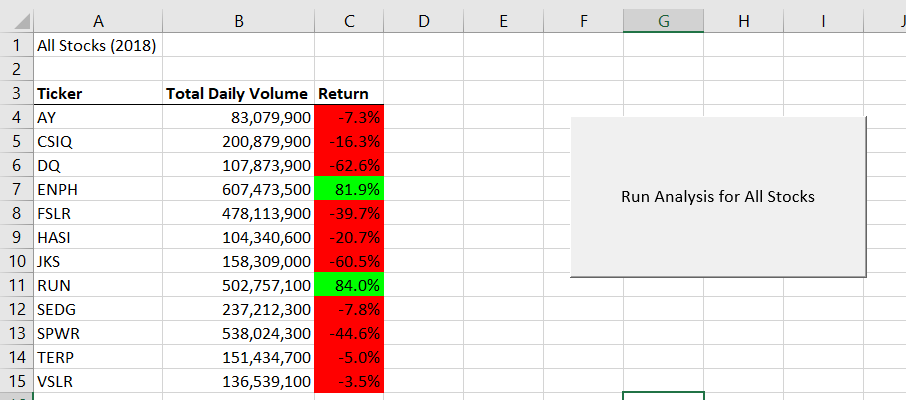
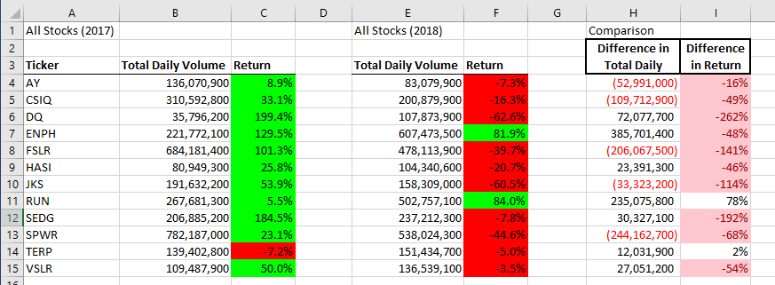
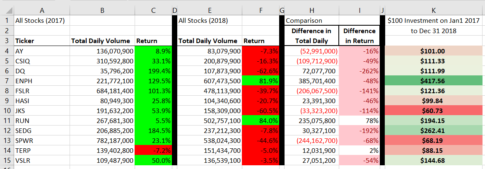
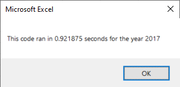
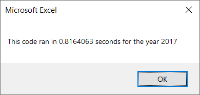
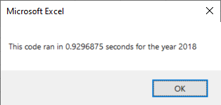

# stocks-analysis_project
Greetings.  Please find my work for the GreenStocks Macro-Enabled Excel workbook & subsequent VBA_Challenge Macro-Enabled Excel workbook in this repository.

## History of Committed Files
GreenStocks Macro-Enabled Excel workbook:
This file was created during the week as I progressed through the lesson plan, and should be considered a "Work-In-Progress" document.

VBA_Challenge Macro-Enabled Excel workbook:
This file was created as the submission for the Weekly Challenge activity and should be considered a completed document, ready for criticism and grading.

### ANALYSIS
#### Overview of Project
The purpose of this analysis was to assist our client in the creation of a Macro.  By using our skills in the language: Visual Basic for Applications, we were able to create this Macro for the client.  

This Macro will let our client focus on meaningful data, and our client will not have to spend anytime going through the raw data that he provided to us initially.

#### Results - Stock Return Performance
We can compare the performance of the 12 selected stocks in 2017 versus the performance in 2018.  To state it briefly, 2017 was a good year and 2018 was a bad year, as far as returns were concerned.  An observer can quickly see the differences in these two images, between the green and the red cells: 

10 of the 12 stocks showed less returns in 2018 than 2017, including 4 stocks that were over 100 points lower in 2018 than 2017.  Only 2 stocks had better returns in 2018 than 2017, with stock "RUN" showing the highest increase in returns performance.

While it is true that "RUN" had positive returns both years, the green shading does not show us anything about the amplitude of those returns.  Consider "ENPH," which is the only other stock to have positive returns in both years.  A $100 investment in "ENPH" on Jan. 1, 2017 would be worth $417.56 on Dec. 31, 2018; a $100 investment in "RUN" over the same time period would only be worth $194.15.  Even "SEDG," which shows negative returns in 2018, had a better 2-year outcome - $100 invested in "SEDG" over the same time period would be worth $262.41 

#### Results - Refactored Code
The refactored code was successful at reducing the execution time for the Macro.  Roughly 0.1 seconds was removed from the execution time.  That may not seem like alot, but if the volume of data was to greatly increase, that time may prove significant.

For 2017 data, the execution time was lowered from 0.92 seconds to 0.81 seconds:

For 2018 data, the execution time was lowered from 0.92 seconds to 0.78 seconds.

#### Summary
The advantages of refactoring code can be vast, if one does accept that 'bad code,' which performs poorly, does exist in the world.  In this exercise, we have shown the result of refactoring to be a reduction in execution time.  Beyond just that, there could be cases where 'bad code' only works on one specific dataset that it was created for; there could be cases where 'bad code' runs, but takes so long that users of the code decide against using it at all; there could be cases where 'bad code' would run, but there is not enough processing power in the machine that is attempting to run it.  In all of these cases, refactored code would be a huge advantage.

The disadvantages to refactoring code are pretty simple: time and money.  If one considers the time and effort, and cost, of the Developer resource(s) that is/are needed to perform the refactoring of the code, then it may not be worth it to refactor the code.  Take our current dataset, original code, and refactored code as an example.  We reduced the execution time by one-tenth of a second, and it took me about 2 hours to perform the refactoring.  In a real-world scenario, where the client was only going to use the Macro on the current dataset, and never on any other dataset, the refactoring was not worth it.  We came up with the same results, and saved less than one second of execution time.  The trade-off for 2 hours of development work could be seen as a waste.

In our code, specifically, there are some definite advantages to the refactored code.  For instance, the introduction of the ticker-index variable was good, because now the code is going through the data, and storing all of the pertinent values in one loop.  After that is complete, then the code is writing all of those stored values onto another sheet in the workbook afterwards.  In the original code, the process was to loop through the data, find the values for one stock name at a time, switch sheets in the workbook, write the values, switch back to the raw data sheet in the workbook, loop through the data again... and so on.  This interuption of the looping, and the switching back and forth between sheets was probably time consuming during execution of the code.  Once this change was made, during refactoring, was when I did observe the reduction in the execution time.

